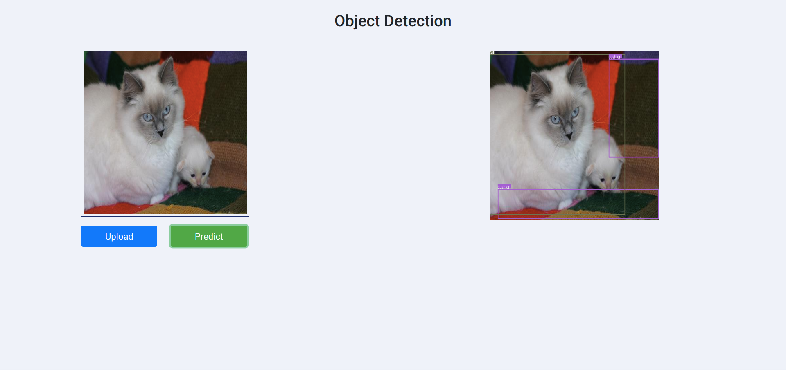
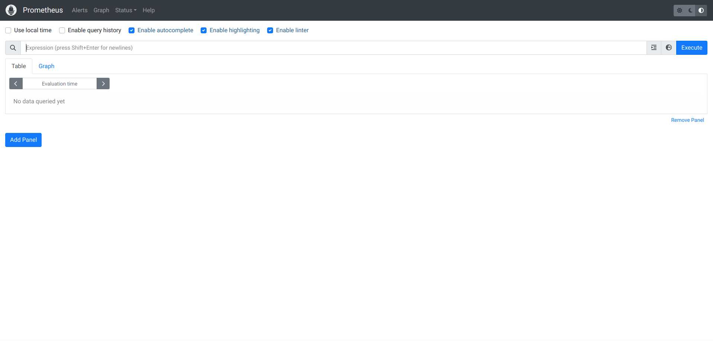

# Intro

An application for detect object in an image. It is ready to be deployed to AWS through GitHub Actions:
- Python distribution: Anaconda
- Container manager: Docker
- Data versioning: DVC
- Code versioning: Git
- Storage: S3
- Experiment tracking: MLFlow
- System monitoring: Prometheus+Grafana
- Model serving: BentoML
- CI/CD: Github Actions
- Deployment infrastructure: AWS

# Sevices
- FastAPI: 8000
- BentoML: 3000
- Grafana: 3001
- Prometheus: 9090
- MLFlow: 5000
- Node-exported: 9100

# Usage
Below is command for each component
## Anaconda
```bash
conda create -n pytorch -y

conda activate pytorch

pip install -r requirements.txt
```
## Git
```bash
git init

git remote add origin ...

git branch -M main

git add .

git commit -m 'OK'

git push -u origin main
```
## DVC
```bash
dvc repro

dvc add artifact/data_ingestion/data
```
## MLFlow
```bash
mlflow server --host 127.0.0.1 --port 8080
```
## BentoML
```bash
bentoml models list
```
### For testing
```bash
bentoml serve app.server.service:svc --reload

python3 app/server/request.py
```
### For containerize
```bash
bentoml build

bentoml containerize object_detection_service:latest -t endpoint

docker run --rm -p 3000:3000 endpoint
```
### For cleaning
```bash
bentoml delete object_detection_service --yes

bentoml models delete model --yes
```
## FastAPI
### For testing
```bash
fastapi dev app/client/app.py
```
## For containerize
```bash
docker build -t app app/client

docker run --rm -p 8000:8000 app
```
## Docker
```bash
cd app

docker compose up

docker compose down
```
## AWS
- Create bucket
- Create iamuser
- Config aws cli

```bash
aws configure
```
If deploy:
- Create container registry
- create virtual server
- Config github action environment variable
# Demo


